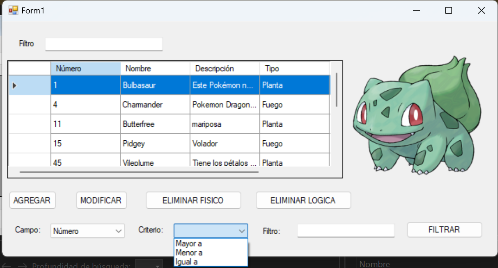

## Pokemon_app - Curso C# Nivel 2 
Aplicación de escritorio realizada en el curso de Maxiprograma.

Es una aplicación de gestión de elementos, en este caso Pokemons.

El motor de base de datos utilizado es Microsoft SQL Server.

En la aplicación se pueden realizar las tareas básicas de un CRUD.

Permite crear nuevos Pokemons, visualizarlos en una tabla, modificarlos y borrarlos.

Posee dos metodos de borrado, el borrado físico y el lógico.

Permite realizar filtrados desde la misma aplicación y también haciendo llamados a la base de datos.

Se utilizó arquitectura en capas, manejo de excepciones y validaciones.

### Tecnologías utilizadas:
- C#
- .NET Framework 4.8
- SQL Server
- Windows Forms
- ADO.NET

  
  

